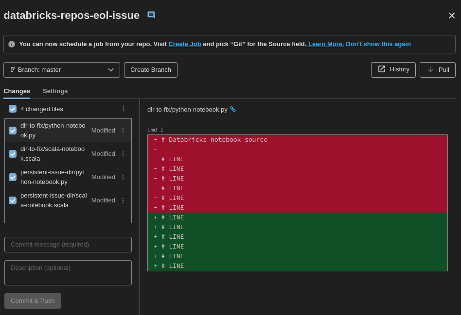
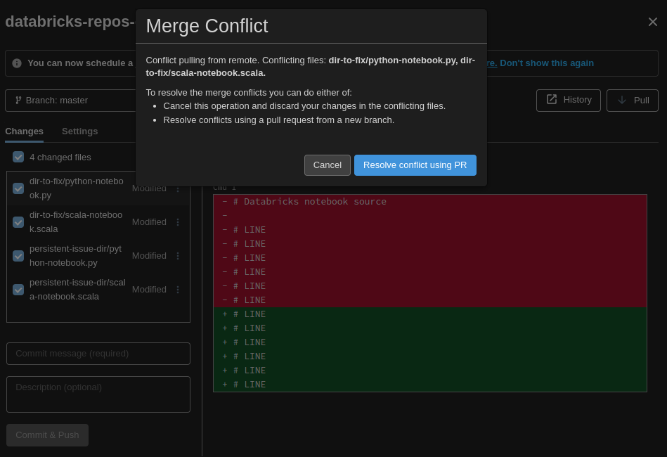
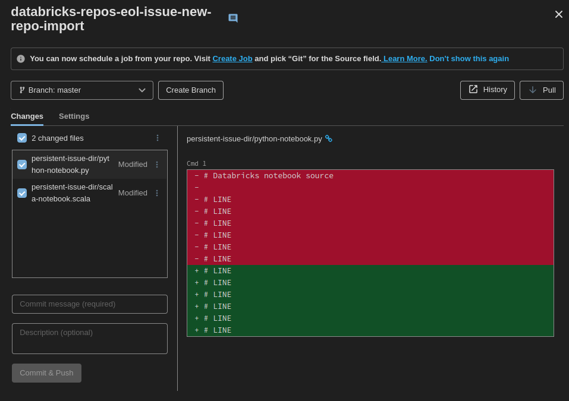

# Databricks Repos - End of Line interaction
How to solve the automatic git diff casued by End of Line convention in Databricks Repos.

### IMPORTANT
The following is written 2022-10-08 and is subject to change as Databricks continuously rolls out platform changes.

# Quick fix
If you want to quickly fix the problem by changing the end of line config for all .py and .scala files (consider impact) and never look back:

Add a `.gitattributes` file to the root for your repository containing:
```
#.gitattributes

# Force all .scala and .py files to use LF as EoL
*.py text eol=lf
*.scala text eol=lf

```

Run from root if repo:
```bash
git add --renormalize .
```

Then make a new commit and push to origin.


# Long solution

## Introduction

This repo will demonstrate how to solve the issue of notebooks being marked as modified, when using [Databricks Repos](https://learn.microsoft.com/en-us/azure/databricks/repos/).

Databricks Repos use the End of Line (EoL) control character LF for **notebooks**. And usage of CRLF will be automatically converted to LF when imported to the Databricks workspace. This becomes an issue whenever a developer commits a notebook using CRLF which is the default for some operating systems, as this will cause the notebook to be marked as modified due to the EoL conversion. As shown:


> **_NOTE:_** This issue currently **only** affects **notebooks**. 

Below follows a table of the most popular OS defaults.

|               OS            |  EoL  |
| --------------------------- | ----- |
| Unix-like (macOS and Linux) |   LF  |
| Windows                     | CRLF  |

Hence this problem tends to appear if a developer commits code after developing on their local windows computer 
without taking into account the EoL configuration. But this issue can also happen under other circumstances and in other OS. 

## The Effect (why should I care?)
- **It can cause business critical CI/CD pipelines to fail!**
- Harder to code review.
- Developer experience:
  - Confusion why some files appear as modified.
  - Higher risk of making mistakes. As the repository grows, scrolling though an endless list of modified files in different depths of the directory hierarchy will make it harder for the developer to find and include correct files in a commit. 
  - Trust in platform.
- Cluttered git history.

# Step by step

The commit history and content of this repo demonstrates how to practically solve the issue in detail for an already existing repo. And you can follow along step by step to see the differences.

## Objective
The objective is to make all .py and .scala files currently and in future added to the `dir-to-fix/` directory not to result in any automatic changes due to EoL conventions.
You can think of this directory as the directory where you currently store all notebooks in your own repo.

## Initial commit (commit 3efac5794e6deedf9cd50aa0f4e5ccc8288502f5)
Initial commit repository tree
```
.
├── dir-to-fix
│   ├── python-notebook.py
│   └── scala-notebook.scala
└── persistent-issue-dir
    ├── not-py-notebook.py
    ├── not-scala-notebook.scala
    ├── python-notebook.py
    └── scala-notebook.scala
```

In this commit all files added use the CRLF formatted EoL.
And as such when importing to the repo to your Databricks workspace the EoL conversion diff appears immediately:


> Note the interaction of the non-notebook files ('not-py-notebook.py' and 'not-scala-notebook.scala') do not show up in the list of modified files even though they also use CRLF.

## Add .gitattributes configuration file (commit 945f1da7b61a5db9b06ea976724db0f99a7f5d3e)
Now we add the .gitattributes file to the root of the repo. In this case since we only want the EoL configuration for .py and .scala files to affect a single directory, the content looks as following:
```
# Set .scala and .py files to use LF if located inside dir-to-fix directory
dir-to-fix/*.py text eol=lf
dir-to-fix/*.scala text eol=lf

# To force all .py and .scala files in repo to use LF, delete all above lines. Then uncomment lines below.
#*.py text eol=lf
#*.scala text eol=lf
```

Now stage the file, make a new commit and push. You will see if pull the new commit into the repo in Databricks that the issue still persist. So adding the dotfile is not enough!


## Renormalize repo (commit 33bc3f958e8d9d546cf283baba1a87bfa9f275bf)
In order for the new EoL configuration to take effect on already added files, we need to run the git command (from root of repo):
```bash
git add --renormalize .
```
Now if we look at the `git status` the files inside the directory has outstanding changes:

```ShellSession
user@host:~/databricks-repos-eol-issue$ git log
commit 945f1da7b61a5db9b06ea976724db0f99a7f5d3e (HEAD -> master, origin/master)
Author: Richard <git.nordstrom@gmail.com>
Date:   Sat Oct 8 13:13:27 2022 +0200

    adding .gitattributes

commit 3efac5794e6deedf9cd50aa0f4e5ccc8288502f5
Author: Richard <git.nordstrom@gmail.com>
Date:   Sat Oct 8 13:09:25 2022 +0200

    initial commit of dos formated CRLF files
user@host:~/databricks-repos-eol-issue$ git status
On branch master
Your branch is up to date with 'origin/master'.

nothing to commit, working tree clean
user@host:~/databricks-repos-eol-issue$ git add --renormalize .
user@host:~/databricks-repos-eol-issue$ git status
On branch master
Your branch is up to date with 'origin/master'.

Changes to be committed:
  (use "git restore --staged <file>..." to unstage)
	modified:   dir-to-fix/python-notebook.py
	modified:   dir-to-fix/scala-notebook.scala

user@host:~/databricks-repos-eol-issue$ git commit -m "renormalize"
```

Now stage the changes, make a new commit and push.

If you now try to pull the new changes to the already existing repo in Databricks, you will experience an error that require manual intervention to solve. Because when you first imported the repo to Databricks, it automatically staged changes of the notebooks and the latest commit in the remote repo also contain changes of some of the same files.



> **Imagine if this would happend in an automated pipeline that is trying to update to the new HEAD of a branch for a release repo; production workloads can malfuction!**

To solve this manually you can either disregard the currently staged changes in the Databricks repo, or import the remote repo to a new directory in Databricks.

In this instance we create a new repo in Databricks and can verify the files we wanted to fix, no longer appear as changed. Only the notebooks inside `persistent-issue-dir/` that we intentionally choose not to modify still appear as modified:



> **_NOTE:_** There is no need to add the .gitattributes file and renormalize in two different commits, and was only done to explicitly demonstrate the need of renormalizing. 


## Further interaction
Adding a new CRLF notebook inside the local directory will cause git to replace all CRLF with LF in the "state" of the repo (by default stored in `.git/`), but will still keep the original format in your local working directory and a warning will appear when trying to stage such files. Which in this case can be demonstrated by trying to copy an originally added CRLF notebook in `persistent-issue-dir/`  into the `dir-to-fix` directory.

```ShellSession
user@host:~/databricks-repos-eol-issue/$ cp persistent-issue-dir/python-notebook.py \
dir-to-fix/new-python-notebook.py
user@host:~/databricks-repos-eol-issue$ git add dir-to-fix/new-python-notebook.py 
warning: CRLF will be replaced by LF in dir-to-fix/new-python-notebook.py.
The file will have its original line endings in your working directory
```


# Considerations
- Consider only to apply the EoL enforcements on a limited scope and files of your Repo.
  If you for example do not only have notebooks in your repo, but also binaries, images etc.
  that might depend on a certain EoL convention.
